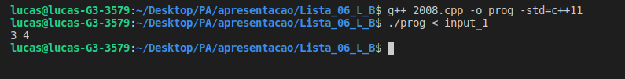
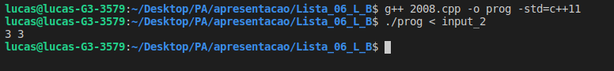

## README

Trabalho 06

Disciplina **Projeto de Algoritimo**

Professor **Mauricio Serrano**

Alunos:

|Nome|Matricula|git|
|--|--|--|
|Brian Lui |15/0006802|[@brian2397](https://github.com/Brian2397)|
|Lucas Machado |15/0015917|[@lmmLucasMachado](https://github.com/lmmLucasMachado)|

### Descrição do problema 2008 URI

O Comitê Central em Nlogônia é formado por muitos membros do congresso. Como o sistema político é dicotômico, cada membro do congresso pertence a um dos dois partidos: o Partido Sério Mortal e o Partido Festa! Festa!. Por tradição, chamam-os de DSP e PPP, respectivamente.

Edward é um jornalista investigativo. Ele descobriu que os congressistas são corruptos e vai mudar de partido, se for oferecido à ele uma determinada quantidade de Nlogmoney. Cada membro do Congresso tem o seu preço específico, mas todos eles têm um preço. Como de costume na política, existem rivalidades entre alguns pares de congressistas. Rivais nunca aceitariam estar no mesmo partido.

Edward tem um orçamento e quer usá-lo para fazer alguns congressistas mudarem de partido e assim coletar provas irrefutáveis ​​para sua investigação. Ao fazer isso, ele tem que respeitar rivalidades: depois que todos os políticos envolvidos aceitarem sua proposta, os rivais devem ser colocados em diferentes partidos.

Edward quer causar o máximo impacto. Você pode ajudá-lo a descobrir o número máximo de congressistas que podem pertencer a DSP se ele usar no máximo todo o seu orçamento para esse objetivo? Da mesma forma, o que é o número máximo de membros do Congresso que pode pertencer a PPP sob o mesmo restrições?

### Entrada
A entrada contém vários casos de teste; cada caso de teste é formatado como segue.
A primeira linha contém quatro inteiros D, P, R e B, que representam, respectivamente, o número de congressistas que, inicialmente, pertencem a DSP (1 ≤ D ≤ 100), o número de congressistas que, inicialmente, pertencem a PPP (1 ≤ P ≤ 100), o número de rivalidades entre os membros do congresso (1 ≤ R ≤ 2,000), e o orçamento do jornalista expresso em Nlogmoney (1 ≤ B ≤ 104). Os membros do DSP são identificados com números inteiros de 1 a distintas D, enquanto os membros do PPP são identificados com inteiros distintos de 1 a P. A segunda linha contém D inteiros S1, S2, ..., SD, indicando que i membro de DSP mudará de partido se oferecido Si Nlogmoney (1 ≤ Si ≤ 100 para i = 1, 2, ..., D). A terceira linha contém inteiros P T1, T2, ..., TP, indicando que j membros de PPP vão mudar de partido, se for oferecido Tj Nlogmoney (1 ≤ Tj ≤ 100 para j = 1, 2, ..., P). Cada uma das próximas R linhas descreve uma rivalidade com dois inteiros X e Y, onde X representa o membro de DSP e Y o de PPP que são rivais (1 ≤ X ≤ D e 1 ≤ Y ≤ P).

### Saída
Para cada caso de teste na entrada, a saída deve conter dois números inteiros representando o número máximo de congressistas que podem pertencer a DSP usando o orçamento dado e, da mesma forma, o número máximo dos congressistas que pode pertencer a PPP usando o orçamento dado.

### Executar programa

- Compile o programa : g++ 2008.cpp  -o prog -std=c++11
- Execute o programa com: ./prog 
- Em seguida coloque os dados que o problema necessite, ou utiliza os arquivos de input na pasta, com um dos comandos abaixo:
- Execute: ./prog < input_1
- Execute: ./prog < input_2

### Prints aplicação

